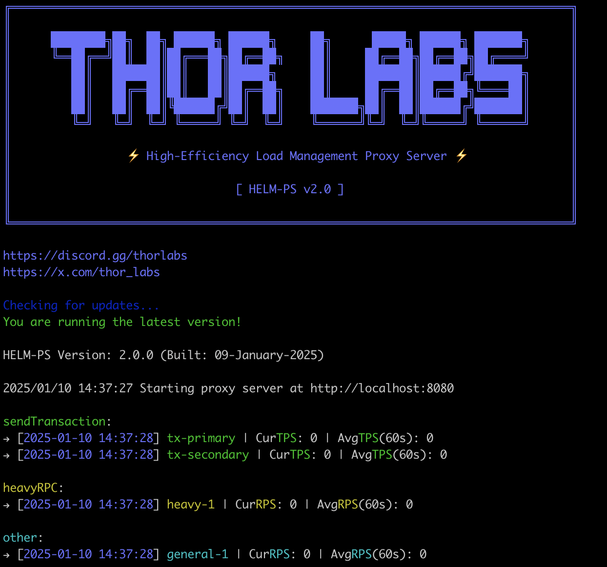

# HELM-PS: High-Efficiency Load Management Proxy Server

This is a Request Per Second (RPS) and Transaction Per Second counter and limiter proxy server application. It forwards HTTP requests to a specified URL while counting the number of requests it receives every second. Additionally, it offers the option to limit requests before forwarding them to the target server, helping users manage their tasks and requests effectively. This tool is ideal for performance testing and monitoring the rate of requests to your servers, providing insights into server load and performance.

## Features

- Configurable proxy URLs and port
- Debug mode for additional logging
- Automatically calculate average RPS and TPS within a configurable time window
- Request Rate Limiting
- sendTransaction Rate Limiting
- Load balancing strategies (all, round robin, weighted round robin)
- Dynamically load TPS and RPS threshold settings without requiring a restart

## Getting Started

To run the HELM-PS, you'll need to have [Go](https://golang.org/dl/) installed on your machine. This guide assumes that you have Go setup correctly.

## Installation

-   [Get the latest version of the tool](https://github.com/thorlabsDev/helm-ps/releases)
-   Make sure you choose the right version for your OS

## Configuration
Before starting the server, you need to configure it by modifying the `config.json` file. If the configuration file does not exist, the application will create one with default settings.

Here are the configurable parameters:

* `url`: The target URLs to which the proxy will forward the incoming requests. There is no limit on the number of URLs that can be configured.
* `port`: The port on which the proxy server will listen.
* `debugMode`: Enables detailed logging for debugging purposes.
* `seconds`: The number of seconds over which to calculate the average RPS.
* `rateLimitEnabled` (boolean): Set to 'true' to enable the rate limiter. Set to 'false' to disable the rate limiter.
* `loadbalance`: The load balancing strategy to use ('all', 'normal', 'weighted').
* `maxRPS` (integer): Specifies the maximum number of general requests (excluding sendTransaction) allowed per second.
* `maxTPS` (integer): Specifies the maximum number of sendTransaction requests allowed per second.
### Example configuration:
```json
{
  "port": 8080,
  "debugMode": false,
  "seconds": 60,
  "rateLimitEnabled": true,
  "loadbalance": "normal",
  "endpoints": [
    {
      "url": "http://rpc-va-zesty.thornode.io/",
      "maxRPS": 330,
      "maxTPS": 180
    },
    {
      "url": "http://rpc-us-west-2.thornode.io/",
      "maxRPS": 180,
      "maxTPS": 80
    },
    {
      "url": " http://rpc-us-east-2.thornode.io/",
      "maxRPS": 300,
      "maxTPS": 150
    }
  ]
}
```
## Running the Server
To start the proxy server, prepare your config file and run the executable.

Once started, the server will log its activity. You can make HTTP requests to http://localhost:`port` where `port` is the port number specified in your `config.json`. In your Solana bot config, replace RPC URL with the proxy server URL.

## Load Balancing Strategies
The HELM-PS supports three request distribution strategies:

* `all` (Failover): Sends the same request concurrently to all configured endpoints. It waits for responses and uses the first successful one, providing redundancy in case one or more endpoints fail.  This is not load balancing in the traditional sense, but it enhances reliability.
* `normal` (Round Robin): Distributes requests sequentially across all endpoints in a cyclical manner. Each endpoint gets a turn to process a request, ensuring even distribution regardless of individual endpoint capacity.
* `weighted` (Weighted Round Robin): Distributes requests across endpoints based on their configured maxRPS values. Endpoints with higher maxRPS receive a proportionally larger share of requests, allowing you to direct traffic according to endpoint performance or capacity.

### Key Considerations

* `all`: Ideal for prioritizing reliability. It ensures a response is received even if some endpoints are down, but it can be the most resource-intensive strategy since it sends the same request to all endpoints concurrently.
* `normal`: Provides simple, even distribution across all endpoints, making it a balanced choice for both performance and reliability.
* `weighted`: Offers the most granular control over traffic distribution by allowing you to allocate requests proportionally based on endpoint capabilities. This can be tuned for optimal performance by directing more traffic to high-performance endpoints.

### Important Note for Solana Transactions
While there is no risk of duplicate transactions, Solana validators may employ firewall rules or rate limiting to protect their infrastructure from excessive load. Using the `all`  strategy with transaction requests can potentially trigger these measures, resulting in some requests being blocked or delayed.


## Rate Limiting

Control and limit the incoming request rate to your proxy server with the configurable rate limiting feature.

### Behavior
When rate limiting is enabled, HELM-PS distinguishes between general requests and transaction-specific requests (sendTransaction).
Requests exceeding the configured maximum request or transaction per second (maxRPS/maxTPS) will receive an HTTP 429 (Too Many Requests) error response and will not be forwarded to the target server. This feature helps you manage your tasks more effectively by ensuring that the server does not get overloaded with excessive requests.
It's important to note that while the application can limit requests, there may be cases of overshoot. To ensure optimal performance, it is recommended to keep the RPS/TPS below 10% of the actual capacity of the server.

### Custom HTTP Error Codes
The HELM-PS uses the following custom HTTP status codes to manage rate limiting:
* `439 StatusTransactionRateLimitExceeded`: This status code is returned when the number of transaction-specific requests (sendTransaction) exceeds the configured maxTPS (maximum transactions per second).
* `449 StatusRequestRateLimitExceeded`: This status code is returned when the number of general requests exceeds the configured maxRPS (maximum requests per second).

These custom status codes help differentiate between general request rate limits and transaction-specific rate limits, allowing for more precise control and monitoring of your server's load.

Note: Even if users encounter these custom status codes, the requests are not endpoint returns. The requests are distributed normally to the configured endpoints, ensuring continuous load balancing and handling by the HELM-PS.

If a user sees these errors, they should consider optimizing their throughput because excessive requests are being sent, leading to unnecessary resource consumption.

### Monitoring

If debugMode is enabled in the `config.json`, the server will log every incoming request and the current RPS/TPS calculation. Otherwise, it will print the current and average RPS/TPS at intervals specified by the seconds configuration.

## Managing Performance with the HELM-PS
The HELM-PS proxy server application is designed to help you manage and monitor the rate of requests to your servers. It provides insights into server load and performance, allowing you to optimize resource utilization and ensure smooth operation. However the performance impact of the HELM-PS depends on various factors such as the hardware it's running on, the configuration settings, and the workload it's handling. Here are some potential impacts to consider:
* Overhead: The application adds some overhead due to request counting, limiting, and logging. However, this overhead is typically minimal unless the server is already under heavy load. When running the HELM-PS alongside other applications, it's important to ensure that your hardware and system resources are sufficient to handle the combined load.
* Latency: Request processing may introduce some latency (around 0.05ms), especially when the rate limiter is turned on. This latency can vary based on the server's workload and the complexity of the request processing logic.
* Resource Utilization: The application consumes CPU, memory, and network resources. The impact on resource utilization depends on factors like the number of requests, the complexity of the request processing logic, and the efficiency of the implementation. With the addition of TPS limiting, it's important to consider how transaction-specific rate limiting might impact the overall performance, particularly in scenarios where transaction requests are frequent. Proper tuning of the `maxTPS` setting is crucial to ensure that the server remains responsive without overloading.
* Scalability: In some cases, the application may limit the scalability of the server by restricting the number of concurrent requests it can handle efficiently. However, this limitation can be mitigated by properly configuring the application and the server.
  Overall, while the application may introduce some performance degradation, the impact is usually minimal and manageable. Proper configuration, monitoring, and optimization can help mitigate any performance issues and ensure smooth operation.

## Troubleshooting
* Performance Degradation: If you notice performance degradation, review your configuration settings and server capacity to identify potential bottlenecks.
* Overshoot: If the RPS/TPS exceeds the recommended limits, consider decreasing the limit to match with target server's limit.


## Disclaimer
The information, recommendations, and guidelines provided in this document are presented in good faith and believed to be accurate based on the current state of knowledge and technology. However, they are provided without any warranty or guarantee of any kind, either expressed or implied, including, without limitation, warranties of merchantability or fitness for a particular purpose. Users are advised to exercise their own judgment and discretion when implementing or using the tools and techniques described herein. The authors, contributors, and publishers of this document shall not be held liable for any damages, losses, or consequences, whether direct, indirect, special, incidental, or consequential, arising out of or in connection with the use or reliance on this documentation or any information contained within.

## Contact Us
For any inquiries, feedback, or to report bugs, please reach out to us via our official Discord server:

[Join ThorLabs Discord Server](https://discord.gg/thorlabs)

To report a bug or any other issue, kindly submit a ticket within the Discord server. Our dedicated team will review and address your concerns promptly.
