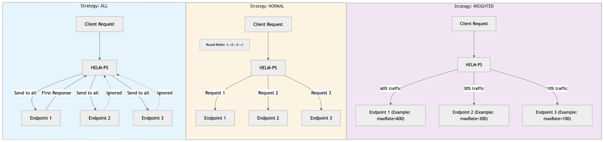

# HELM-PS: High-Efficiency Load Management Proxy Server

HELM-PS is a powerful proxy server designed to efficiently distribute and manage RPC requests across multiple endpoints. It's perfect for users who need reliable load balancing and rate limiting for their RPC services.


## Features

- Smart load balancing across multiple endpoints
- Automatic rate limiting
- Real-time metrics monitoring
- Auto-updates with zero downtime
- Configuration hot-reloading

## Performance & Best Practices

### Impact
- **Latency**: Adds minimal overhead (~0.05ms per request)
- **Resource Usage**: Light on system resources under normal conditions
- **Reliability**: Load balancing and failover features improve overall stability

### Best Practices
- Keep RPS/TPS at least 10% below your endpoint's actual capacity
- For optimal performance with transactions:
  - Avoid "all" strategy for high-volume transaction requests
  - Use "weighted" strategy when endpoints have different capacities
  - Use "normal" strategy when endpoints are equally powerful
- Enable debug mode temporarily to tune your rate limits
- Monitor the metrics to catch potential bottlenecks early

## Getting Started

1. Download the latest version of HELM-PS from our releases page
2. Extract the downloaded file to your preferred location
3. Run the `helm-ps` executable

The server will start automatically on port 8080 (default).

## Configuration

HELM-PS uses two main configuration files:

### config.json
```json
{
    "port": 8080,
    "debugMode": false,
    "seconds": 60,
    "rateLimitEnabled": false,
    "loadBalancing": {
        "sendTransaction": "weighted",
        "heavyRPC": "normal",
        "other": "all"
    }
}
```

### rpc.csv
```csv
methodGroup,alias,url,maxRate
sendTransaction,tx-primary,http://rpc1.example.com,20
sendTransaction,tx-secondary,http://rpc2.example.com,10
heavyRPC,heavy-1,http://rpc3.example.com,100
other,general-1,http://rpc4.example.com,40
```

## Load Balancing Strategies

HELM-PS supports three load balancing strategies:

- `weighted`: Distributes traffic based on endpoint capacity
- `normal`: Simple round-robin distribution
- `all`: Sends requests to all endpoints and uses the first successful response



## Method Groups

Requests are categorized into three groups:

1. `sendTransaction`: Transaction-related methods
2. `heavyRPC`: Resource-intensive methods (like getSupply, getProgramAccounts)
3. `other`: All other RPC methods

## Monitoring

HELM-PS provides real-time metrics in your terminal:
- Current requests per second (RPS)
- Transactions per second (TPS)
- 60-second moving averages
- Per-endpoint statistics

## Rate Limiting

Enable rate limiting in `config.json` to protect your endpoints from overload. Set individual rate limits per endpoint in `rpc.csv`.

HELM-PS enforces a hard cap of 1000 requests per second per endpoint. This limit cannot be exceeded even if you set a higher `maxRate` in your configuration. This hardcap helps prevent accidental overload of endpoints.

### Custom Error Codes
HELM-PS uses unique HTTP status codes for different rate limit scenarios:
- `439`: Transaction rate limit exceeded (for sendTransaction requests)
- `449`: Request rate limit exceeded (for all other requests)

These custom codes help you distinguish between transaction and general request limits in your error handling.

## Auto-Updates

HELM-PS checks for updates automatically and can seamlessly upgrade itself without losing any requests.

## Debugging

1. Set `debugMode": true` in config.json
2. Check the `logs` directory for detailed logs
3. Watch the terminal for real-time debugging information

## Common Issues

1. **"Another instance is already running"**
- Only one instance of HELM-PS can run at a time
- Check if HELM-PS is already running in your processes

2. **"No endpoints configured"**
- Verify your rpc.csv file exists and contains valid endpoints
- Each method group needs at least one endpoint

3. **Rate limit exceeded**
- Check your maxRate settings in rpc.csv
- Consider increasing limits or adding more endpoints

### License
Apache License 2.0 - See LICENSE file for details.

### Disclaimer
This software is provided "as is", without warranty of any kind, express or implied. The authors and maintainers are not responsible for any damages or losses that may arise from its use. Users should thoroughly test the gateway in their specific environment before deploying to production.

### Contact
For additional support or questions, please contact our support team via our discord server.